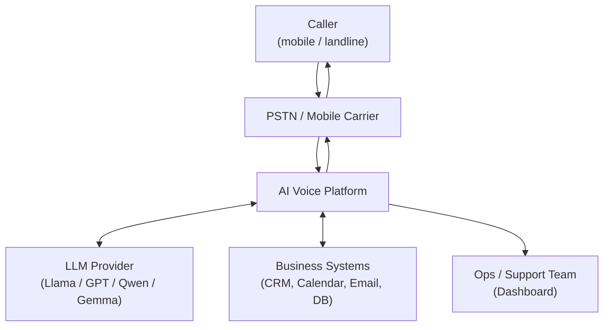
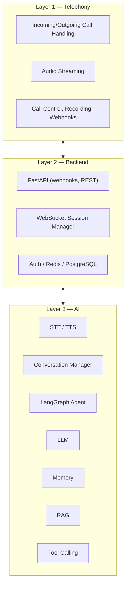
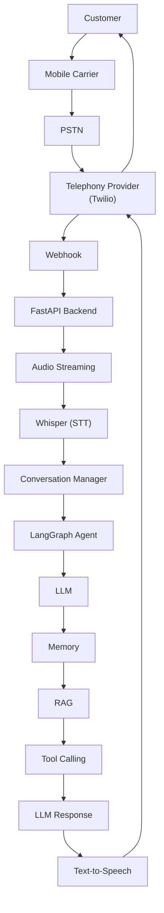
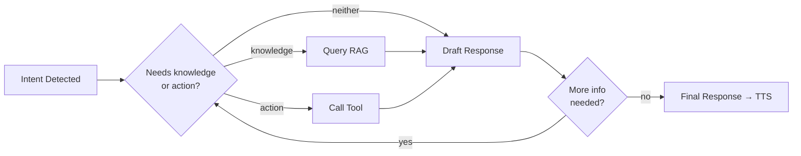

# High-Level Design (HLD)

## 1. Purpose

This document describes the high-level architecture of the AI Voice Platform: its
layers, major components, and the end-to-end flow of a call through the system. It
traces back to the functional and non-functional requirements defined in
`docs/02_SRS/software_requirements_specification.md`.

Diagrams in this document use [Mermaid](https://mermaid.js.org/) syntax, which
renders natively on GitHub/GitLab and most documentation tooling.

---

## 2. System Context

At the highest level, a caller on the public telephone network interacts with the
platform, which in turn depends on external AI models and business systems.



---

## 3. Layered Architecture

The platform is organized into three layers, matching FR-1 through FR-23.



---

## 4. Complete Call Flow

This is the canonical end-to-end sequence for a single conversational turn,
referenced by FR-3 through FR-11.



Plain-text version (for quick reference / non-rendering viewers):

```
Customer
  ↓
Mobile Carrier
  ↓
PSTN
  ↓
Telephony Provider (Twilio)
  ↓
Webhook
  ↓
FastAPI
  ↓
Audio Streaming
  ↓
Whisper (STT)
  ↓
Conversation Manager
  ↓
LangGraph
  ↓
LLM
  ↓
Memory
  ↓
RAG
  ↓
Tools
  ↓
LLM Response
  ↓
Text-to-Speech
  ↓
Telephony Provider
  ↓
Customer
```

**Note:** Memory, RAG, and Tools are drawn here in call-flow order for readability,
but in the actual agent loop (Section 6) the LLM can consult them in any order, and
can loop back through Tools/RAG multiple times before producing a final response.

---

## 5. Component Responsibilities

| Component | Layer | Responsibility | Traces to |
|---|---|---|---|
| Telephony Provider | 1 | Bridges PSTN to backend; call lifecycle, streaming, recording, webhooks | FR-1, FR-2, FR-3, FR-16, FR-22 |
| FastAPI Backend | 2 | Receives webhooks, manages sessions/auth, exposes REST + WebSocket APIs | FR-22, FR-23, NFR-10 |
| Session Manager | 2 | Tracks active call state, coordinates AI modules per call | FR-4, FR-8 |
| Whisper (STT) | 3 | Converts caller audio to text in real time | FR-6 |
| Conversation Manager | 3 | Holds message history, detected language, session state | FR-4, FR-5, FR-8 |
| LangGraph Agent | 3 | Detects intent, routes workflow, orchestrates multi-step reasoning | FR-10 |
| LLM | 3 | Reasoning and response generation | FR-9, FR-10, FR-11 |
| Memory | 3 | Session memory (per call) and long-term memory (per customer) | FR-21 |
| RAG | 3 | Retrieves company knowledge (FAQs, policies, manuals) | FR-9 |
| Tool Calling | 3 | Executes actions against calendar, CRM, email, SQL, REST APIs | FR-11, FR-12, FR-13, FR-14 |
| Text-to-Speech | 3 | Converts final response text to natural audio | FR-7 |
| Analytics Module | — | Generates transcripts, summaries, sentiment, dashboard reports | FR-17, FR-18, FR-19, FR-20 |

---

## 6. Inner Agent Loop

Within a single turn, the LangGraph agent may consult Memory, RAG, and Tools more
than once before finalizing a response (e.g., look up a customer record, then check
availability, then confirm before booking):



---

## 7. Cross-Cutting Concerns

These apply across all layers and are addressed structurally rather than as a single
component (traces to NFR-1 through NFR-12):

- **Logging & Monitoring** — every service emits structured logs and metrics.
- **Security** — authenticated/authorized access to all internal APIs; encrypted
  storage of call audio, transcripts, and customer data.
- **Fault tolerance** — a failed tool call or RAG lookup degrades gracefully
  (e.g., the agent apologizes and offers a human handoff) rather than dropping the
  call.
- **Scalability** — Telephony, Backend, and AI layers scale independently; the AI
  layer is the most compute-intensive and is expected to scale horizontally per
  concurrent call.

---

## 8. What This Document Does Not Cover

Detailed service interfaces, data schemas, state machines, and API contracts belong
in `docs/04_LLD/` (Low-Level Design), not here.