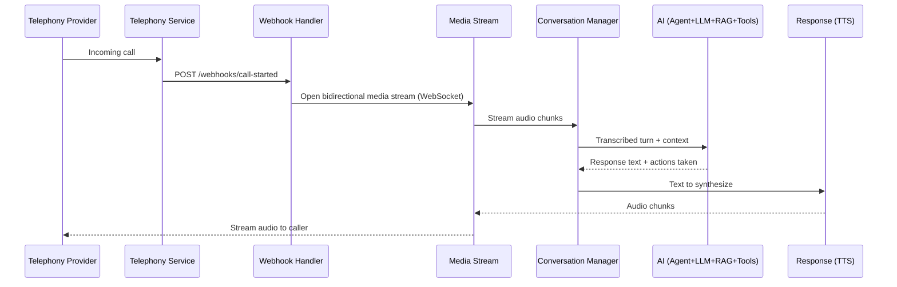

# Low-Level Design (LLD)

## 1. Purpose

This document describes every module at implementation level: responsibilities,
interfaces, data schemas, and internal flow. It builds on `docs/03_HLD/high_level_design.md`
and traces back to requirement IDs in `docs/02_SRS/software_requirements_specification.md`.

Each module below corresponds to a service folder under `services/` (see the repo
structure discussion) and can be built, tested, and scaled independently.

---

## 2. End-to-End Module Sequence

The canonical flow through the modules for a single call:



Plain-text version:

```
Telephony Service
  ↓
Webhook
  ↓
Media Stream
  ↓
Conversation
  ↓
AI
  ↓
Response
```

---

## 3. Module: Telephony Service

**Responsibilities:** receive/place calls, manage call lifecycle, open the bidirectional
media stream, record calls, send webhooks. Traces to FR-1, FR-2, FR-3, FR-16, FR-22.

**Interfaces (REST):**

| Method | Path | Purpose |
|---|---|---|
| POST | `/calls/outbound` | Initiate an outgoing call |
| POST | `/calls/{call_id}/transfer` | Transfer an active call to another number/agent |
| POST | `/calls/{call_id}/hangup` | End a call |
| GET | `/calls/{call_id}` | Get current call status |

**Webhook events emitted (to Backend):**

```
call.started
call.ringing
call.answered
call.media.started
call.media.stopped
call.ended
call.failed
call.recording.available
```

**Data model — `CallSession`:**

```python
class CallSession(BaseModel):
    call_id: str
    direction: Literal["inbound", "outbound"]
    from_number: str
    to_number: str
    provider: str                    # e.g. "twilio"
    provider_call_sid: str
    status: Literal["ringing", "in_progress", "completed", "failed"]
    started_at: datetime
    ended_at: datetime | None
    recording_url: str | None
```

---

## 4. Module: Webhook Handler (Backend / FastAPI)

**Responsibilities:** validate and receive telephony webhooks, create/update
`CallSession` records, trigger media stream setup. Traces to FR-22, FR-23.

**Interface:**

```
POST /webhooks/telephony
  headers: X-Provider-Signature
  body: provider-specific event payload
```

**Behavior:**

1. Verify webhook signature against the provider's shared secret.
2. Map the provider event to an internal `CallEvent`.
3. On `call.started`: create a `CallSession`, allocate a session in Redis, open the
   media stream WebSocket to the Media Stream module.
4. On `call.ended`: close the session, flush transcript/state, trigger Analytics.

---

## 5. Module: Media Stream

**Responsibilities:** bidirectional real-time audio streaming between the telephony
provider and the AI pipeline (caller audio in, synthesized audio out). Traces to FR-3.

**Interface (WebSocket):**

```
WS /media-stream/{call_id}
  inbound frame:  { "event": "media", "payload": "<base64 audio chunk>" }
  outbound frame: { "event": "media", "payload": "<base64 audio chunk>" }
  control frames: "start", "stop", "mark"
```

**Behavior:**

- Buffers inbound audio and performs Voice Activity Detection (VAD) to detect
  end-of-utterance (or caller barge-in mid-response).
- Forwards completed utterances to the Speech module (STT).
- Streams TTS audio chunks back to the provider as they're generated, to minimize
  perceived latency.

---

## 6. Module: Speech (STT / TTS)

**Responsibilities:** transcribe caller audio; synthesize response audio. Traces to
FR-6, FR-7.

**Interfaces:**

```python
def transcribe(audio_chunk: bytes, language_hint: str | None) -> Transcript: ...

class Transcript(BaseModel):
    text: str
    language: str
    confidence: float
    is_final: bool

def synthesize(text: str, voice_id: str, language: str) -> AsyncIterator[bytes]: ...
```

---

## 7. Module: Conversation Manager

**Responsibilities:** maintain per-call conversation state — message history,
detected language, current session variables. Traces to FR-4, FR-5, FR-8.

**Data model — `ConversationState`:**

```python
class Turn(BaseModel):
    role: Literal["customer", "assistant", "system"]
    text: str
    timestamp: datetime
    language: str

class ConversationState(BaseModel):
    call_id: str
    turns: list[Turn]
    detected_language: str
    session_variables: dict[str, Any]   # e.g. verified_customer_id, booking_in_progress
```

**Interface:**

```python
def append_turn(call_id: str, turn: Turn) -> None: ...
def get_context(call_id: str, max_turns: int = 20) -> ConversationState: ...
```

Stored in Redis for the duration of the call (low-latency read/write), persisted to
PostgreSQL on call end for long-term storage and analytics.

---

## 8. Module: Agent (LangGraph)

**Responsibilities:** detect intent, route the conversation graph, orchestrate
multi-step reasoning (LLM ↔ RAG ↔ Tools) until a final response is ready. Traces to
FR-10.

**State graph (nodes):**

```
detect_intent → { needs_knowledge?, needs_action?, ready_to_respond? }
    needs_knowledge = true  → query_rag       → back to detect_intent
    needs_action    = true  → call_tool        → back to detect_intent
    ready_to_respond = true → generate_response → end
```

**Interface:**

```python
class AgentState(BaseModel):
    call_id: str
    conversation: ConversationState
    scratchpad: list[dict]        # intermediate RAG/tool results this turn
    final_response: str | None

def run_agent_turn(state: AgentState) -> AgentState: ...
```

---

## 9. Module: LLM

**Responsibilities:** prompt construction, model invocation, output validation.
Traces to FR-9, FR-10, FR-11.

**Interface:**

```python
def build_prompt(state: AgentState, retrieved_docs: list[str], tool_results: list[dict]) -> str: ...
def generate(prompt: str, model: str) -> LLMOutput: ...

class LLMOutput(BaseModel):
    text: str
    tool_calls: list[ToolCall]
    finish_reason: str
```

Output validation checks: response is non-empty, requested tool calls reference
known tools with valid arguments, and content passes basic safety checks before
being sent to TTS.

---

## 10. Module: Memory

**Responsibilities:** session memory (per call) and long-term memory (per customer,
across calls). Traces to FR-21.

**Data model:**

```python
class LongTermMemory(BaseModel):
    customer_id: str
    known_facts: dict[str, Any]     # e.g. preferred_language, past_issues
    last_updated: datetime

class SessionMemory(BaseModel):
    call_id: str
    working_facts: dict[str, Any]   # cleared at end of call
```

**Interface:**

```python
def get_customer_memory(customer_id: str) -> LongTermMemory: ...
def update_customer_memory(customer_id: str, facts: dict) -> None: ...
```

---

## 11. Module: RAG

**Responsibilities:** index and retrieve company knowledge (FAQs, policies,
manuals) to ground LLM responses. Traces to FR-9.

**Pipeline:**

```
Document ingestion → chunking → embedding → vector DB upsert
Query time: query embedding → similarity search → top-k chunks → LLM context
```

**Interface:**

```python
def index_document(doc_id: str, text: str, metadata: dict) -> None: ...
def retrieve(query: str, top_k: int = 5, filters: dict | None = None) -> list[RetrievedChunk]: ...

class RetrievedChunk(BaseModel):
    text: str
    source_doc_id: str
    score: float
```

---

## 12. Module: Tool Calling

**Responsibilities:** execute real-world actions via typed tool adapters. Traces to
FR-11, FR-12, FR-13, FR-14.

**Common tool contract:**

```python
class ToolCall(BaseModel):
    tool_name: str
    arguments: dict[str, Any]

class ToolResult(BaseModel):
    tool_name: str
    success: bool
    data: dict[str, Any] | None
    error: str | None

def execute_tool(call: ToolCall) -> ToolResult: ...
```

**Registered tools (initial set):**

| Tool | Purpose |
|---|---|
| `calendar.check_availability` / `calendar.book` | Appointment scheduling |
| `crm.lookup_customer` / `crm.update_record` | Customer verification, CRM updates |
| `email.send` | Send confirmation/follow-up emails |
| `db.query` | Read-only SQL lookups against business data |

Each tool call has a timeout and a defined failure behavior (the agent is told the
call failed and can retry, choose another path, or offer human handoff) — this is
what makes NFR-4 (fault tolerance) concrete at the tool layer.

---

## 13. Module: Analytics

**Responsibilities:** transcript generation, call summarization, sentiment analysis,
reporting. Traces to FR-17, FR-18, FR-19, FR-20.

**Triggered:** on `call.ended` webhook, asynchronously (does not block call teardown).

**Data model:**

```python
class CallAnalytics(BaseModel):
    call_id: str
    transcript: list[Turn]
    summary: str
    sentiment: Literal["positive", "neutral", "negative", "mixed"]
    resolved: bool
    handed_off_to_human: bool
    tools_used: list[str]
    duration_seconds: int
```

---

## 14. Cross-Module Error Handling

| Failure | Handling |
|---|---|
| STT returns low-confidence transcript | Agent asks caller to repeat/clarify rather than guessing |
| Tool call times out | Agent informs caller, retries once, then offers human handoff |
| RAG returns no relevant results | Agent falls back to general LLM knowledge, flags as "unverified" internally |
| LLM output fails validation | Regenerate once with a stricter prompt; if it fails again, escalate to human handoff |
| Media stream drops mid-call | Backend marks call as `failed`, triggers a callback/retry per business policy |

---

## 15. What This Document Does Not Cover

Deployment topology (service placement, scaling policy, infra-as-code) belongs in
`infrastructure/` and a future `05_Deployment/` doc, not here.