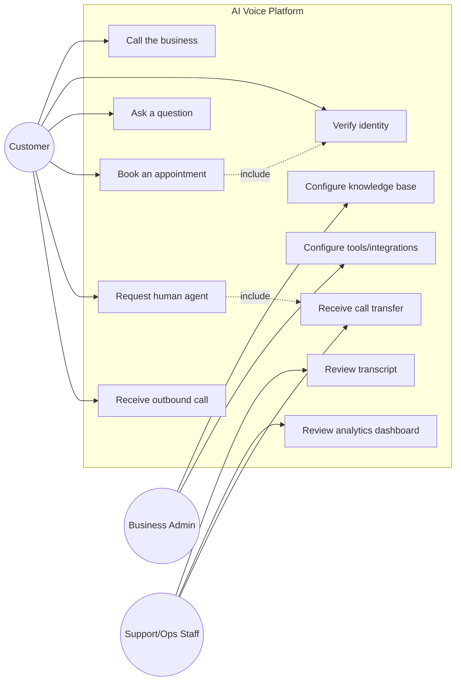
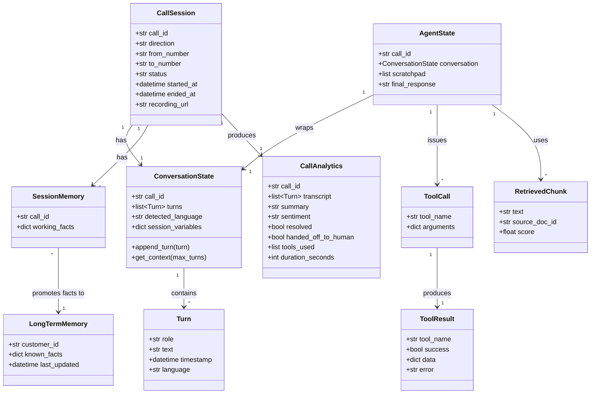
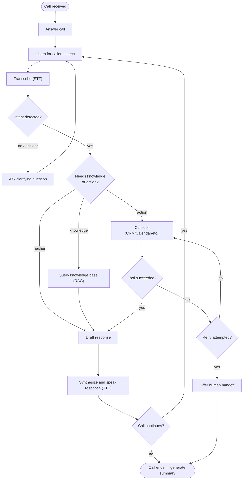
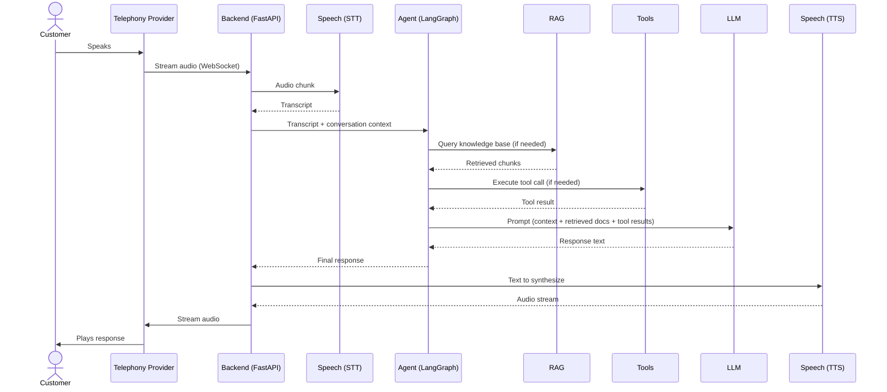
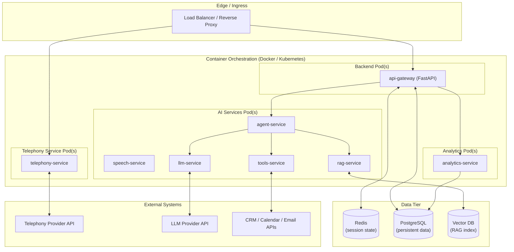

# UML Diagrams

## 1. Purpose

This document specifies the five UML views for the AI Voice Platform: Use Case,
Class, Activity, Sequence, and Deployment. Each section includes a rendered diagram
(Mermaid, so it previews directly on GitHub/GitLab) plus the structured spec you can
use to recreate/refine the same diagram in draw.io.

These trace back to the requirements in `docs/02_SRS/` and the design in
`docs/03_HLD/` and `docs/04_LLD/`.

---

## 2. Use Case Diagram

**Actors:**

| Actor | Description |
|---|---|
| Customer | Person calling in or being called |
| Business Admin | Configures the agent (knowledge base, tools, workflows) |
| Support/Ops Staff | Reviews transcripts, analytics; receives human handoffs |
| Telephony Provider | External system (not a human actor, but a system actor) |

**Use cases:**

- Call the business (Customer)
- Verify identity (Customer, System)
- Ask a question / get an answer (Customer)
- Book an appointment (Customer)
- Request a human agent (Customer)
- Receive an outbound call (Customer)
- Configure knowledge base (Business Admin)
- Configure tools/integrations (Business Admin)
- Review call transcript (Support/Ops Staff)
- Review analytics dashboard (Support/Ops Staff)
- Receive call transfer (Support/Ops Staff)

*In draw.io:* use the UML → Use Case shape set; actors as stick figures on the
left/right, use cases as ellipses inside a system boundary rectangle, `<<include>>`
relationships as dashed arrows.

---

## 3. Class Diagram

Core domain classes, matching the schemas defined in `docs/04_LLD/low_level_design.md`.

*In draw.io:* UML → Class shape; three-compartment boxes (name / attributes /
methods), solid line + open diamond for composition (`CallSession` → `ConversationState`),
plain solid arrows for association/dependency as shown above.

---

## 4. Activity Diagram

Activity flow for handling a single inbound call turn, including decision points.

*In draw.io:* UML → Activity shape set; rounded rectangles for actions, diamonds for
decisions, filled circle for start, circle-with-ring for end.

---

## 5. Sequence Diagram

A single conversational turn, end to end (matches `docs/04_LLD/` §2, expanded with
RAG/Tools detail).

*In draw.io:* UML → Sequence shape set; lifelines for each participant, solid arrows
for synchronous calls, dashed arrows for returns — matches the flow above 1:1.

---

## 6. Deployment Diagram

Physical/infrastructure deployment of the services (traces to NFR-1, NFR-8, NFR-9).

*In draw.io:* UML → Deployment shape set; 3D boxes ("nodes") for each pod/host,
cylinders for data stores, dashed arrows for external API dependencies.

---

## 7. Diagram-to-Requirement Traceability

| Diagram | Primarily validates |
|---|---|
| Use Case | FR-1–FR-2, FR-4–FR-5, FR-12–FR-15, FR-20 |
| Class | FR-8, FR-9, FR-11, FR-17–FR-21 |
| Activity | FR-4, FR-10–FR-11, FR-15 |
| Sequence | FR-3, FR-6–FR-11 |
| Deployment | NFR-1, NFR-2, NFR-8, NFR-9 |

---

## 8. Next Step

If you want native `.drawio` files (XML) to open directly in draw.io instead of
recreating these from the specs above, let me know and I can generate them per
diagram.